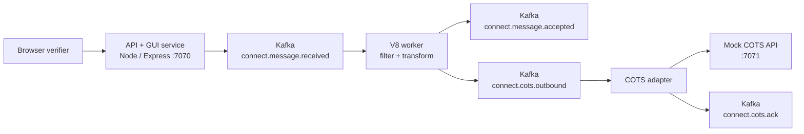

# Modernized Connect V8 Kafka

This repository is a small, working modernization example based on the open source NextGen Connect application.

It shows how one Rhino-based JavaScript channel use case can be moved into a modern event-driven architecture using Node.js, V8, Kafka, and decoupled service modules.

## Plain-English Summary

NextGen Connect, formerly Mirth Connect, is commonly used in healthcare integration to receive, filter, transform, and route messages such as HL7 patient admission events.

The source application uses Rhino-based JavaScript execution for channel scripts. Rhino is an older JavaScript engine on the Java platform. This project modernizes one representative use case by running migrated JavaScript on V8, the JavaScript engine used by Node.js and Chrome, and by moving processing through Kafka topics for asynchronous, scalable message handling.

This is not a full rewrite of NextGen Connect. It is a focused migration slice that is intentionally small enough to understand, run, test, and extend.

## Source Application

Source GitHub repository:

[nextgenhealthcare/connect](https://github.com/nextgenhealthcare/connect)

Source area reviewed for this migration:

- Rhino JavaScript filter and transformer execution
- channel filter/transform model classes
- response-transform and script utility support
- destination routing concepts

Representative source files counted:

- `server/src/com/mirth/connect/server/transformers/JavaScriptFilterTransformer.java`
- `server/src/com/mirth/connect/server/transformers/JavaScriptResponseTransformer.java`
- `server/src/com/mirth/connect/server/util/javascript/JavaScriptUtil.java`
- `server/src/com/mirth/connect/server/util/javascript/JavaScriptScopeUtil.java`
- `server/src/com/mirth/connect/server/util/javascript/MirthContextFactory.java`
- `server/src/com/mirth/connect/server/userutil/DestinationSet.java`
- `core-models/src/com/mirth/connect/model/Filter.java`
- `core-models/src/com/mirth/connect/model/Transformer.java`
- `core-models/src/com/mirth/connect/model/Rule.java`
- `core-models/src/com/mirth/connect/model/Step.java`
- `core-models/src/com/mirth/connect/model/FilterTransformer.java`
- `core-models/src/com/mirth/connect/model/FilterTransformerElement.java`

## Modernized Use Case

The selected use case is **HL7 ADT patient admission processing**.

The flow:

1. Receive an HL7 ADT message through an API.
2. Filter the message using migrated JavaScript running on V8.
3. Transform selected HL7 fields into a normalized `PatientAdmitted` event.
4. Publish processing steps through Kafka.
5. Route the transformed event to a decoupled COTS adapter.
6. Receive an ACK from a mock COTS system.
7. Show the result in a browser GUI.

The sample message extracts:

- patient id from `PID-3`
- patient name from `PID-5`
- date of birth from `PID-7`
- sex from `PID-8`
- patient class from `PV1-2`
- location from `PV1-3`

Successful verification ends with:

```text
COTS_ACKED
patientId: 123456
eventType: PatientAdmitted
```

## Approximate Code Size

These numbers are approximate line counts for the selected migration slice, not for the entire NextGen Connect application.

| Area | Approx. lines of code | What it means |
|---|---:|---|
| Legacy selected Rhino/filter-transform surface | ~2,390 | Source-side Java/Rhino classes related to the selected filter, transform, script execution, and routing concepts |
| Modernized runtime implementation | ~535 | API, Kafka broker adapter, V8 script runner, HL7 parser, worker, COTS adapter, status store |
| Modernized runtime + GUI + smoke tests | ~1,031 | Runtime plus browser verifier and executable smoke tests |

The reduction is possible because this project migrates a narrow use case rather than rebuilding the full platform.

## Source Stack To Modern Stack

| Concern | Source application | Modernized example |
|---|---|---|
| Main platform | Java application | Node.js application |
| JavaScript engine | Rhino | V8 |
| Script execution | embedded Java/Rhino script utilities | isolated Node worker threads with timeout protection |
| Message flow | channel filter/transform/routing inside Connect | event-driven API + Kafka topics |
| Async backbone | internal channel processing | Apache Kafka |
| External system integration | destination connectors | decoupled COTS adapter service |
| UI for verification | Connect Administrator in full product | lightweight browser verification dashboard |
| Deployment in this demo | local Windows process | local Windows process, no Docker |
| Testing | source project tests plus manual channel validation | Node unit tests, smoke test, GitHub Actions CI |

## Architecture



More diagrams are in [docs/architecture-diagrams.md](docs/architecture-diagrams.md).

## What Is Running Locally

The current local setup uses a combined Node host:

- API and GUI: `http://127.0.0.1:7070`
- V8 worker: hosted in the same Node process
- COTS adapter: hosted in the same Node process
- Mock COTS API: `http://127.0.0.1:7071`
- Kafka: `127.0.0.1:9092`

The code also supports separate non-Docker Windows processes for API, worker, adapter, and mock COTS service.

## Run As One Node Host

Start Kafka:

```powershell
.\scripts\start-kafka-background.ps1
```

Start the modernized application:

```powershell
.\scripts\start-combined-host.ps1
```

Open the GUI:

```text
http://127.0.0.1:7070
```

Click `Run Migration Check`.

## Run As Non-Docker Microservices

Start Kafka:

```powershell
.\scripts\start-kafka-background.ps1
```

Start separate service processes:

```powershell
.\scripts\start-microservices.ps1
```

Stop tracked service processes:

```powershell
.\scripts\stop-microservices.ps1
```

## API

Submit a channel message:

```http
POST http://127.0.0.1:7070/api/messages
```

Get status:

```http
GET http://127.0.0.1:7070/api/messages/{correlationId}
```

Health:

```http
GET http://127.0.0.1:7070/health
```

## Kafka Topics

- `connect.message.received`
- `connect.message.accepted`
- `connect.message.filtered`
- `connect.message.failed`
- `connect.cots.outbound`
- `connect.cots.ack`
- `connect.deadletter`

## Tests And CI

Run unit tests:

```powershell
npm test
```

Run an end-to-end smoke check against a hosted app:

```powershell
$env:BASE_URL='http://127.0.0.1:7070'
npm run smoke
```

GitHub Actions workflow:

[.github/workflows/ci.yml](.github/workflows/ci.yml)

## Documentation

- [Use cases](docs/use-cases.md)
- [User stories](docs/user-stories.md)
- [Test cases](docs/test-cases.md)
- [Architecture](docs/architecture.md)
- [Architecture diagrams](docs/architecture-diagrams.md)
- [V8/Kafka migration review report](docs/v8-kafka-migration-review.md)

## Repository Layout

- `src/api.js`: API and GUI host.
- `src/services/message-worker.js`: V8 filter/transform worker.
- `src/services/cots-adapter.js`: external COTS integration adapter.
- `src/services/cots-mock-api.js`: mock COTS API for verification.
- `src/v8/script-runner.js`: V8-backed execution boundary.
- `src/domain/hl7.js`: narrow HL7 parser for the selected ADT use case.
- `public/index.html`: browser verification dashboard.
- `scripts/`: Kafka and app startup scripts.
- `test/`: Node unit tests.
