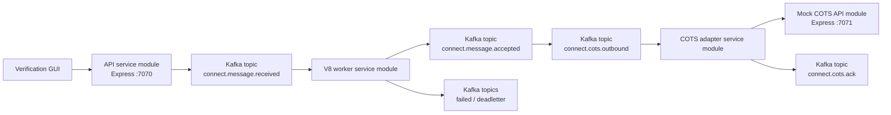
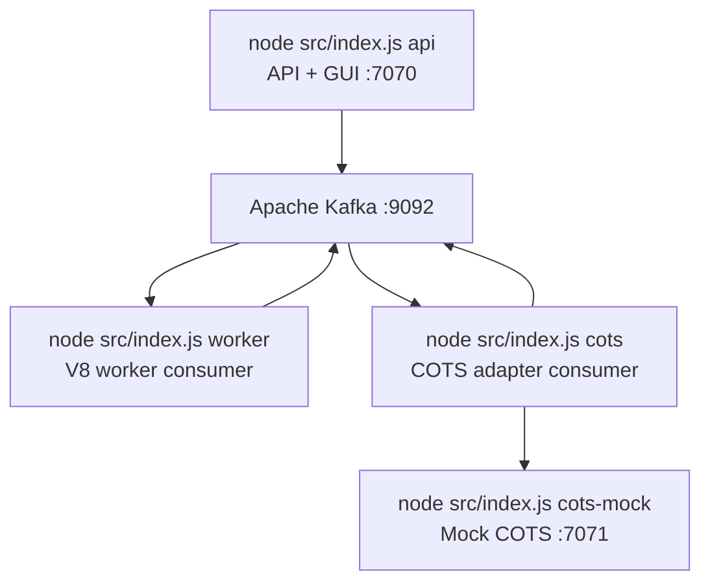
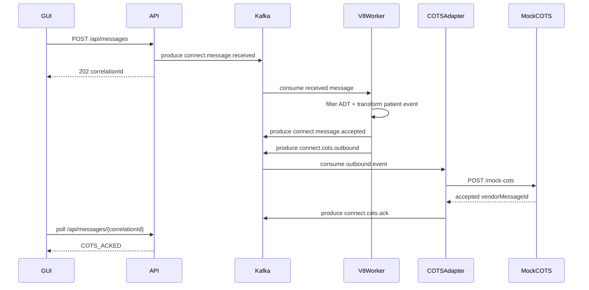

# Architecture Diagrams

## Combined Node Host

```mermaid
flowchart LR
  Browser["Verification GUI"] --> Api["API service module\nExpress :7070"]
  Api --> KafkaReceived["Kafka topic\nconnect.message.received"]
  KafkaReceived --> Worker["V8 worker service module"]
  Worker --> KafkaAccepted["Kafka topic\nconnect.message.accepted"]
  Worker --> KafkaFailed["Kafka topics\nfailed / deadletter"]
  KafkaAccepted --> KafkaCots["Kafka topic\nconnect.cots.outbound"]
  KafkaCots --> Adapter["COTS adapter service module"]
  Adapter --> MockCots["Mock COTS API module\nExpress :7071"]
  Adapter --> KafkaAck["Kafka topic\nconnect.cots.ack"]
```

## Non-Docker Process-Level Microservices

```mermaid
flowchart TB
  ApiProcess["node src/index.js api\nAPI + GUI :7070"]
  WorkerProcess["node src/index.js worker\nV8 worker consumer"]
  AdapterProcess["node src/index.js cots\nCOTS adapter consumer"]
  MockProcess["node src/index.js cots-mock\nMock COTS :7071"]
  Kafka["Apache Kafka :9092"]

  ApiProcess --> Kafka
  Kafka --> WorkerProcess
  WorkerProcess --> Kafka
  Kafka --> AdapterProcess
  AdapterProcess --> MockProcess
  AdapterProcess --> Kafka
```

## Message Lifecycle

```mermaid
sequenceDiagram
  participant GUI
  participant API
  participant Kafka
  participant V8Worker
  participant COTSAdapter
  participant MockCOTS

  GUI->>API: POST /api/messages
  API->>Kafka: produce connect.message.received
  API-->>GUI: 202 correlationId
  Kafka->>V8Worker: consume received message
  V8Worker->>V8Worker: filter ADT + transform patient event
  V8Worker->>Kafka: produce connect.message.accepted
  V8Worker->>Kafka: produce connect.cots.outbound
  Kafka->>COTSAdapter: consume outbound event
  COTSAdapter->>MockCOTS: POST /mock-cots
  MockCOTS-->>COTSAdapter: accepted vendorMessageId
  COTSAdapter->>Kafka: produce connect.cots.ack
  GUI->>API: poll /api/messages/{correlationId}
  API-->>GUI: COTS_ACKED
```
