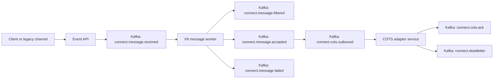

# Architecture

## Design Goals

- **Small migration surface**: only filter, transform, and COTS route for ADT messages.
- **Decoupled services**: API, message worker, and COTS adapter can scale independently.
- **Fault tolerance**: failed script execution and COTS delivery become events, not synchronous request failures.
- **Extensibility**: add new channel use cases by registering scripts and routing targets.
- **Compatibility path**: old Rhino scripts can be translated into modern JavaScript modules gradually.

## Runtime

The JavaScript runtime is V8 through Node.js. Scripts run in worker threads with a timeout. Inputs are explicit:

- `message.raw`
- `message.parsed`
- `channelMap`
- `sourceMap`
- `connectorMap`
- `helpers`

No Java package bridge is exposed. That keeps COTS and infrastructure access outside scripts and inside typed service adapters.

## Kafka Strategy

Kafka topics represent the modernized channel lifecycle. In local development, set `KAFKA_DISABLED=true` to use an in-memory broker for fast smoke testing. In hosted mode, use Kafka at `KAFKA_BROKERS`.

## Scaling Model

- Run multiple API instances behind a load balancer.
- Run multiple workers in the same consumer group for horizontal processing.
- Partition by `channelId` or `patientId` where ordering matters.
- Use the dead-letter topic for retry orchestration and operational triage.
